# Using KeePass with KeeAgent

While KeePass is generally used for storing credentials, it can also be used to store SSH keys as well as *serve* those SSH keys when applications need it.

It's a good idea to use SSH keys when connecting to remote servers rather than username/passwords.  It's also a good practice to generate a keypair for each server you connect to - including when performing remote `git` operations.  

Over time though, the number of keys you need to manage and remember can grow.  There are various ways to solve this, including SSH `.config` files.  KeePass is one way to go about this, by using KeePass and the KeeAgent plugin, we can use the KeePass database as a container for our keys and have it serve when needed.  This has the advantage that the SSH keys are synced with the KeePass database.      

## Install things

### KeePass

Ensure [KeePass Professional Edition](http://keepass.info/download.html) is installed.  You may want to consider using the *portable* edition, and syncing the entire KeePass installation along with your `.kdbx` across your machines.  For example, you could have the KeePass installation in your Google Drive, which includes config file and a plugins folder.  This way, your settings and plugins will carry across machines, reducing the setup required. 

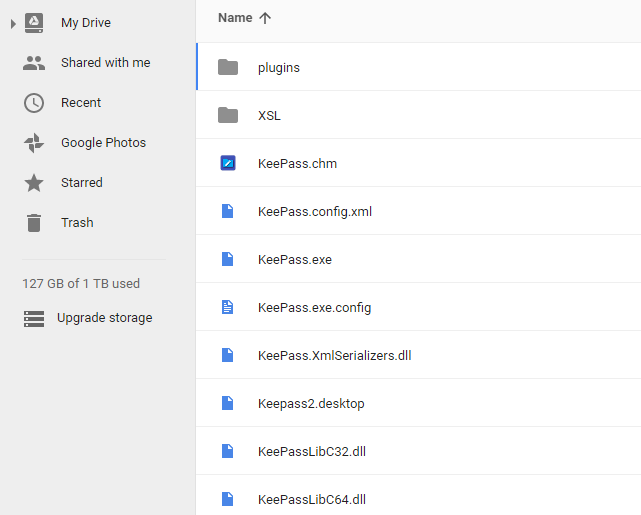  

### Git Bash

Git Bash isn't just the `git` command as most people use it, it's actually a collection of very useful and familiar utilities such as `grep`, `vi`, `awk`, `cut`, but most importantly `ssh` and `scp`.  Have a look at *C:\Program Files\Git\usr\bin* to get an idea of what you can use.

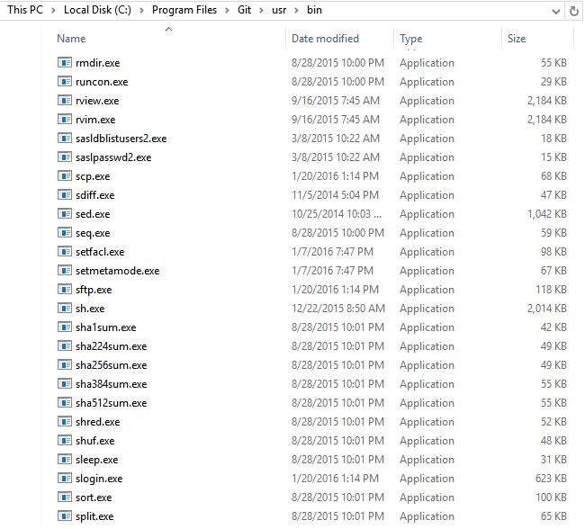

When installing [Git Bash](https://git-scm.com/downloads), I'd recommend the options for using Git from the Windows Command Prompt, and line endings being 'as is'.

### KeeAgent

Install [KeeAgent](http://lechnology.com/software/keeagent/#Download) - it's a simple matter of placing the `KeeAgent.plgx` file in the KeePass plugins folder.

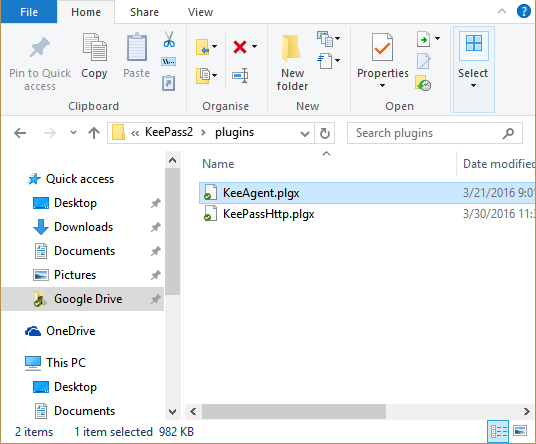

You will need to reopen KeePass for the plugin to appear.  

### Add keys to your remote Git account

A common use case for SSH is accessing your Github or Bitbucket account over `ssh` instead of `http`.   

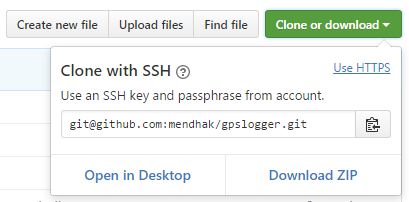

As a prerequisite, [add your public key](https://help.github.com/articles/adding-a-new-ssh-key-to-your-github-account/) to your account.

_____

## Store your keys

Continuing with the Github example, either edit your existing Github entry or create an empty entry, no matter. 

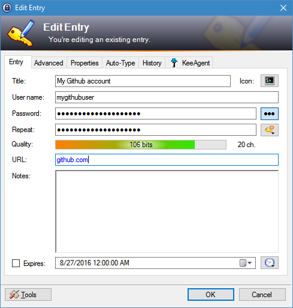

Now for the keys.  Click on the *Advanced* tab and choose to attach files. 

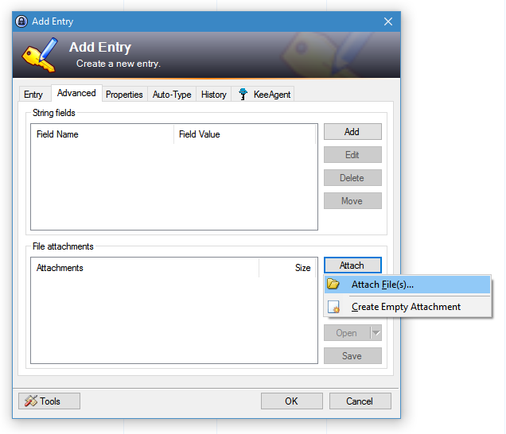

Find your SSH keypair for your remote server and attach them

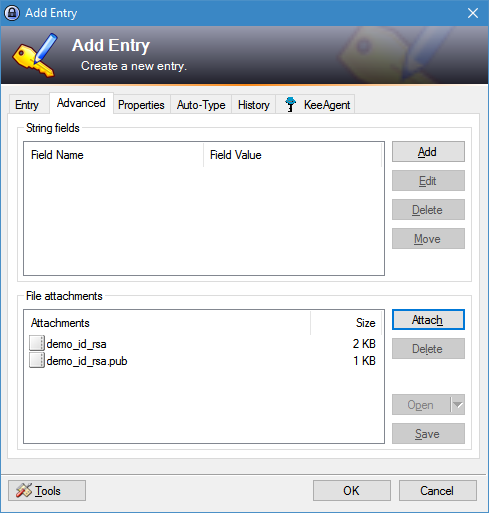

### Load your key with KeeAgent

Click on the KeeAgent tab. Check the *Allow KeeAgent to use this entry* option.  From the *Attachment* option, choose the private key that you attached just a while ago.

You should see the *Key Info* section populate with some information about your keys.  

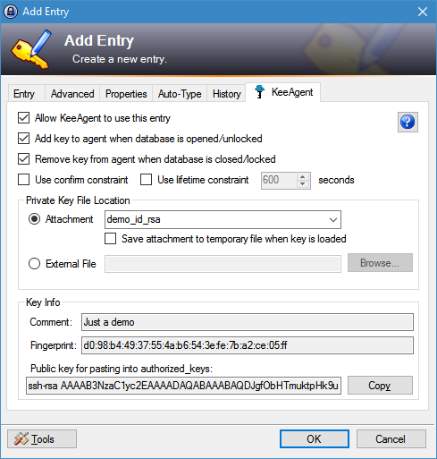

At this point KeeAgent knows about your key but hasn't loaded it.  For the key to be loaded, either reopen the KeePass database, or double click on the *SSH Key Status* column to change the status from *Not Loaded* to *Loaded*

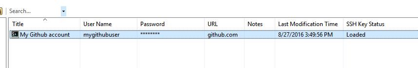

Another way to check which keys are loaded is by *Tools* > *KeeAgent*

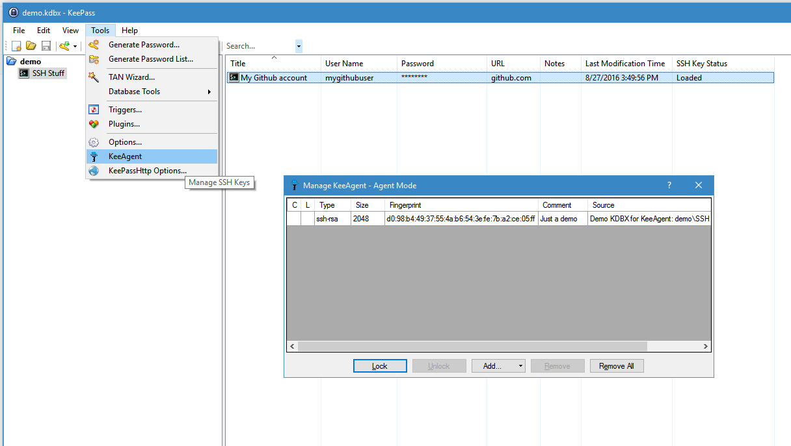

### Tell Git Bash to use KeeAgent

Although KeeAgent is now ready to serve the keys, Git Bash needs to be told about it.  If you open Git Bash now and try a quick test, you should get an error.

>$ ssh -T git@github.com  
>Permission denied (publickey).

Go back to KeePass, and click *Tools* > *Options...* and then click the *KeeAgent* tab. Choose to *Show a notification...*, and more importantly check the boxes in the *Cygwin/MSYS Integration* area.  Add a path such as *C:\Temp\cygsocket* and *C:\Temp\syssocket* or any arbitrary file name you want.  This will create socket files, which is a Unix concept - it allows applications to talk to each other through a file.  In this case, Git Bash will communicate with KeePass through one of these two socket files.

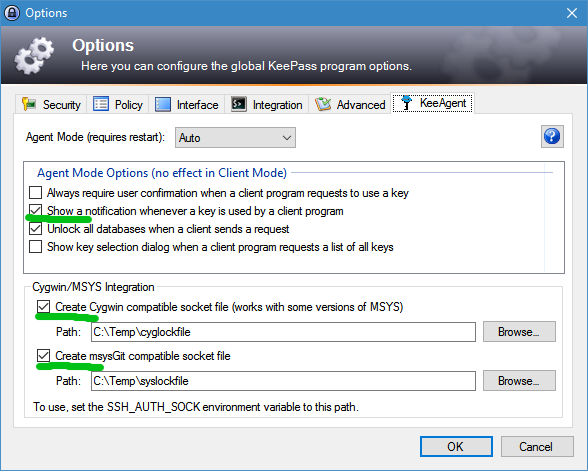  

Again, close and reopen KeePass, then head over to *C:\Temp* or whichever path you specified.  You should see your socket files there. 

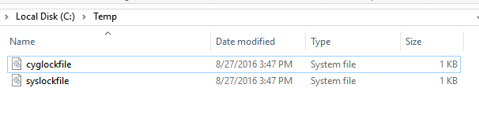  

Using your text editor, or even `vi` in Git Bash, edit/create the `~/.bashrc` file.  This would correspond to *C:\users\username\.bashrc* 

    vi ~/.bashrc

Add the following line to it - it will set the `SSH_AUTH_SOCK` environment variable, pointing at the socket file.  This is what Git Bash needs to know. 

    export SSH_AUTH_SOCK="C:\Temp\cyglockfile"

Close and reopen Git Bash.  Then try your test again.  If it works, you should see a message from Github, and a notification that a key was used.  

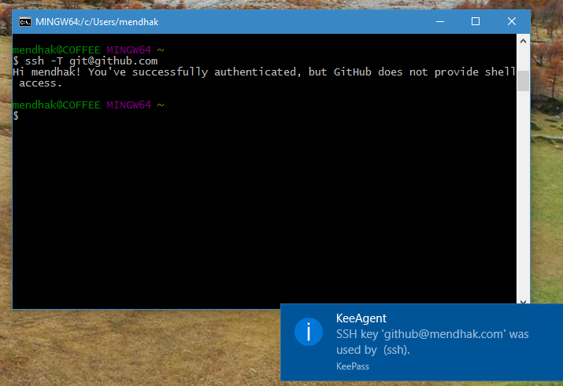

Try out a few `git` commands - `git clone` (with the non-http URL), `git fetch` and `git push`.  In each case it should use the key and show you a notification.

### Private keys with passwords

If your private key had a password on it, KeeAgent will use the password in the password field to unlock it.  In such a case it's better to have created a new entry just for the SSH key instead of using an existing one. 

### Don't load every key

Back in the load step, we left the *Add key to agent when database is opened/unlocked* option checked. 

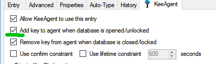

This tells KeeAgent to load this key up whenever this KeePass database is opened.  But if you have around 5 or more keys loaded, your authentication may fail.  This is because SSH Agents work by trying to use every loaded key until it finds one that works.  Many SSH servers don't like this and will close the connection if it sees around 5 or more attempts.  

You should only check the above option for frequent use keys, and a Git server key is a good example.  

For occasional use keys, you can double click the *SSH Key Status* column to load them only when you're about to use it, and even unload a few others.

